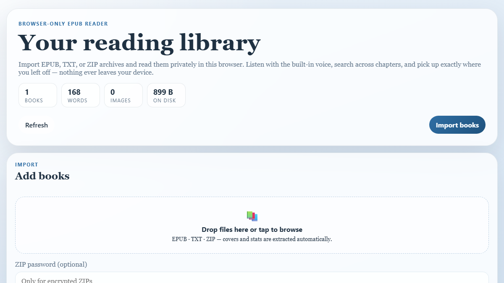
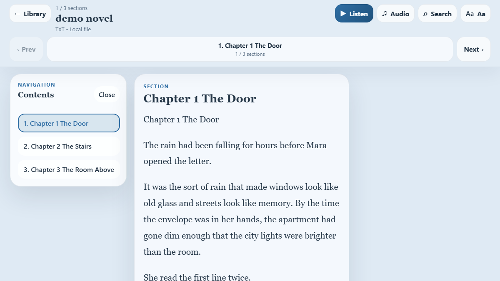
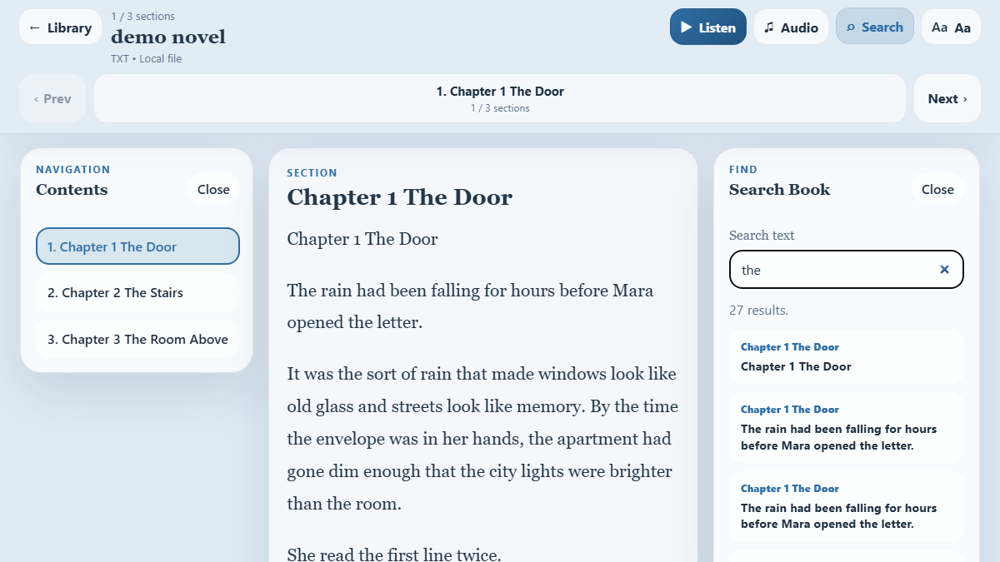
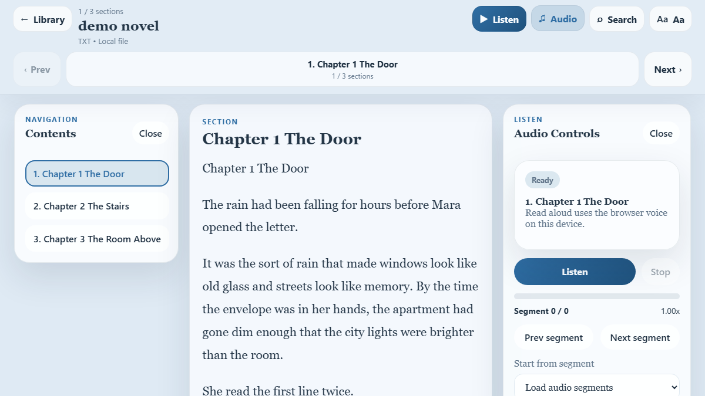

<div align="center">

# Online EPUB Reader

Local-first EPUB/TXT reader that runs **entirely in your browser**. Import books (including ZIP + encrypted ZIPs), keep a private local library in IndexedDB, search across chapters, and use your browser’s built‑in **translate** and **read‑aloud**.

**Live:** https://novel-epub-reader.vercel.app


</div>

## Screenshots

Real screenshots (PNG) from the live app:









> The repo also includes SVG “mock screenshots” in the same folder as a lightweight fallback.

## Table of contents

- [What this is](#what-this-is)
- [Features](#features)
- [Supported files](#supported-files)
- [How to use (end users)](#how-to-use-end-users)
- [Privacy & storage](#privacy--storage)
- [Local development](#local-development)
- [Build & preview](#build--preview)
- [Deploy (Vercel)](#deploy-vercel)
- [Troubleshooting](#troubleshooting)
- [Tech stack](#tech-stack)

## What this is

This is a **personal, local-first** reading app:

- No accounts, no backend, no uploads.
- Your books and progress live in your browser storage (IndexedDB).
- Works great as a “drop files → read instantly” app on desktop and mobile.

## Features

- **Library**: import multiple books and keep them in a local collection.
- **Import formats**: `.epub`, `.txt`, `.zip` bundles, and **encrypted ZIPs** (password prompt).
- **EPUB reader**: chapters/TOC navigation, progress saving, multiple reader flows.
- **Text reader**: smart sectioning for large `.txt` novels.
- **Search**: search across chapters/sections with jump-to-result.
- **Read-aloud**: uses the browser’s built-in speech synthesis and voices.
- **Translation-friendly**: designed to work well with Chrome/Edge “Translate page”.
- **Stats**: word count, estimated reading time, image counts (best-effort).

## Supported files

| Type | Import | Notes |
| --- | --- | --- |
| EPUB | `.epub` | Some EPUBs may not render if corrupted or **DRM-protected**. |
| Text | `.txt` | Split into sections for easier navigation + audio. |
| ZIP | `.zip` | Can contain EPUB/TXT and even nested ZIPs. |
| Encrypted ZIP | `.zip` + password | Enter the password before import (wrong password will fail extraction). |

## How to use (end users)

1. Open the live site: https://novel-epub-reader.vercel.app
2. Import books:
	- Click **Import books**, or drag & drop files into the dropzone.
	- If you’re importing an encrypted ZIP, fill the **ZIP password** first.
3. Pick a book from your library.
4. In the reader you can:
	- Open the **Chapters** panel to jump around.
	- Use **Search** to find text across the book.
	- Use **Audio** to start the browser’s read‑aloud.
	- Use **Settings** to adjust theme, font size, line height, and width.

### Translation tips

- In Chrome/Edge: use the browser menu → **Translate** while on the reader page.
- Translation quality depends on your browser/device language tools.

## Privacy & storage

- Books and progress are stored in **IndexedDB** (via `localforage`).
- Nothing is uploaded by this app.
- If you clear site data / browser storage, you will lose your local library.

## Local development

**Requirements**

- Node.js 20+ recommended
- npm

**Run**

```bash
npm install
npm run dev
```

Then open the URL printed by Vite (usually `http://localhost:5173`).

## Build & preview

```bash
npm run build
npm run preview
```

## Deploy (Vercel)

This project is Vercel-friendly out of the box.

```bash
npx vercel --prod
```

If you’re using a custom domain, you can point it at the latest deployment with:

```bash
npx vercel alias set <deployment-url> novel-epub-reader.vercel.app
```

## Troubleshooting

- **ZIP import says password is wrong**: re-enter the ZIP password and try again. (Some ZIPs use encryption modes that may not be supported everywhere.)
- **Book disappeared**: browser storage was cleared, or the device ran out of storage quota.
- **EPUB fails to open**: the file might be corrupted or DRM-protected.
- **Read-aloud sounds different**: speech voices come from the OS/browser; availability varies by device.

## Tech stack

- React + TypeScript + Vite
- `epubjs` for EPUB rendering
- `@zip.js/zip.js` for ZIP (including password-protected archives)
- `localforage` for IndexedDB persistence
